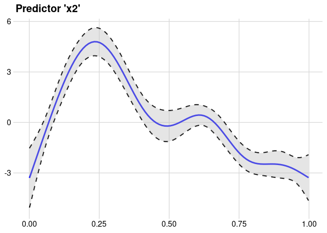
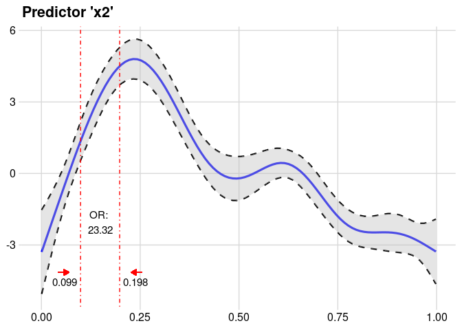
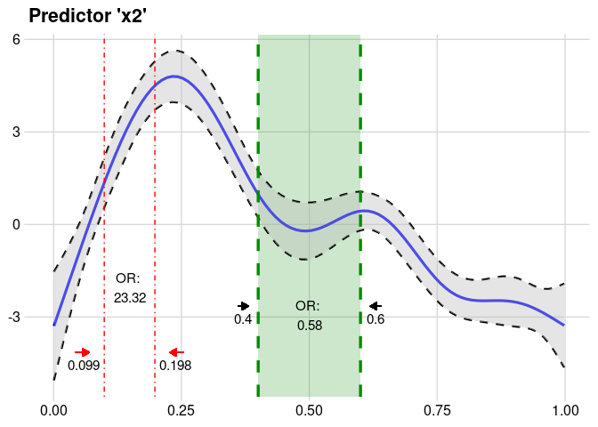

[](https://travis-ci.org/pat-s/oddsratio)
[](https://cran.r-project.org/package=oddsratio)
[](https://cran.r-project.org/web/checks/check_results_oddsratio.html)
[](https://cran.rstudio.com/web/packages/oddsratio/index.html)
[](https://www.tidyverse.org/lifecycle/#stable)
[](https://cran.r-project.org/package=oddsratio)

Functions for calculation and plotting of odds ratios of Generalized
Additive (Mixed) Models and Generalized Linear (Mixed) Models with a
binomial response variable (i.e. logistic regression models).

## Installation

Install from CRAN:

``` r
install.packages("oddsratio")
```

Get the development version from Github:

``` r
remotes::install_github("pat-s/oddsratio")
```

## Examples

### GLM

Odds ratio calculation of predictors `gre` & `gpa` of a fitted model
`fit_glm` with increment steps of 380 and 5, respectively.  
For factor variables (here: `rank` with 4 levels), automatically all
odds ratios corresponding to the base level (here: `rank1`) are returned
including their respective confident intervals. The default level is
95%. However, other levels can be specified with the param `CI`. Data
source: <https://stats.idre.ucla.edu/stat/data/binary.csv>

``` r
library("oddsratio")
library("mgcv")
```

    ## Loading required package: nlme

    ## This is mgcv 1.8-28. For overview type 'help("mgcv-package")'.

``` r
df <- data_glm
df$rank <- factor(df$rank)
fit_glm <- glm(admit ~ gre + gpa + rank, data = df, family = "binomial")

or_glm(data = df, model = fit_glm, 
       incr = list(gre = 380, gpa = 5, CI = 0.95))
```

    ##   predictor oddsratio CI_low (2.5 %) CI_high (97.5 %)          increment
    ## 1       gre     2.364          1.054            5.396                380
    ## 2       gpa    55.712          2.229         1511.282                  5
    ## 3     rank2     0.509          0.272            0.945 Indicator variable
    ## 4     rank3     0.262          0.132            0.512 Indicator variable
    ## 5     rank4     0.212          0.091            0.471 Indicator variable

### GAM

For GAMs, the calculation of odds ratio is different. Due to its
non-linear definition, odds ratios do only apply to specific value
changes and are not constant throughout the whole value range of the
predictor as for GLMs. Hence, odds ratios of GAMs can only be computed
for one predictor at a time by holding all other predictors at a fixed
value while changing the value of the specific predictor. Confident
intervals are currently fixed to the 95% level for GAMs. Data source:
`?mgcv::predict.gam()`

Here, the usage of `or_gam()` is shown by calculating odds ratios of
pred `x2` for a 20% steps across the whole value range of the predictor.

``` r
set.seed(1234)
n <- 200
sig <- 2
df <- gamSim(1, n = n,scale = sig, verbose = FALSE)
df$x4 <- as.factor(c(rep("A", 50), rep("B", 50), rep("C", 50), rep("D", 50)))
fit_gam <- mgcv::gam(y ~ s(x0) + s(I(x1^2)) + s(x2) + offset(x3) + x4, data = df)

or_gam(data = df, model = fit_gam, pred = "x2",
       percentage = 20, slice = TRUE)
```

    ##   predictor value1 value2 perc1 perc2 oddsratio CI_low (2.5%)
    ## 1        x2  0.001  0.200     0    20   2510.77       1091.68
    ## 2        x2  0.200  0.400    20    40      0.03          0.03
    ## 3        x2  0.400  0.599    40    60      0.58          0.56
    ## 4        x2  0.599  0.799    60    80      0.06          0.06
    ## 5        x2  0.799  0.998    80   100      0.41          0.75
    ##   CI_high (97.5%)
    ## 1         5774.53
    ## 2            0.03
    ## 3            0.60
    ## 4            0.06
    ## 5            0.22

If you want to compute a single odds ratio for specific values, simply
set param `slice = FALSE`:

``` r
or_gam(data = df, model = fit_gam,
       pred = "x2", values = c(0.099, 0.198))
```

    ##   predictor value1 value2 oddsratio CI_low (2.5%) CI_high (97.5%)
    ## 1        x2  0.099  0.198  23.32353      23.30424        23.34283

Plotting of GAM smooths is also supported:

``` r
plot_gam(fit_gam, pred = "x2", title = "Predictor 'x2'") +
  cowplot::theme_minimal_grid()
```

<!-- -->

Insert the calculated odds ratios into the smoothing function:

``` r
plot_object <- plot_gam(fit_gam, pred = "x2", title = "Predictor 'x2'")
or_object <- or_gam(data = df, model = fit_gam, 
                    pred = "x2", values = c(0.099, 0.198))

plot <- insert_or(plot_object, or_object, or_yloc = 3,
                  values_xloc = 0.04, line_size = 0.5, 
                  line_type = "dotdash", values_yloc = 0.5,
                  arrow_col = "red")
plot +
  cowplot::theme_minimal_grid()
```

<!-- -->

Insert multiple odds ratios into one smooth:

``` r
or_object2 <- or_gam(data = df, model = fit_gam, pred = "x2", 
                     values = c(0.4, 0.6))

insert_or(plot, or_object2, or_yloc = 2.1, values_yloc = 2,
          line_col = "green4", text_col = "black",
          rect_col = "green4", rect_alpha = 0.2,
          line_alpha = 1, line_type = "dashed",
          arrow_xloc_r = 0.01, arrow_xloc_l = -0.01,
          arrow_length = 0.01, rect = T) +
  cowplot::theme_minimal_grid()
```

<!-- -->
