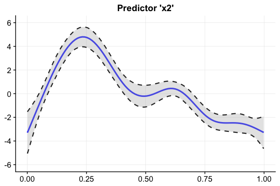
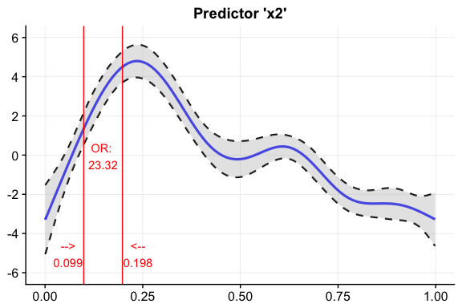
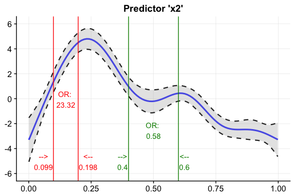

Load example data
-----------------

Data source: `?mgcv::predict.gam`

    library(oddsratio)
    suppressPackageStartupMessages(library(mgcv))
    set.seed(1234)
    n <- 200
    sig <- 2
    dat <- suppressMessages(gamSim(1, n = n, scale = sig))
    dat$x4 <- as.factor(c(rep("A", 50), rep("B", 50), rep("C", 50), rep("D", 50)))

    fit.gam <- mgcv::gam(y ~ s(x0) + s(I(x1^2)) + s(x2) + offset(x3) + x4, data = dat)

GAM example
-----------

### Calculate OR for specific increment step of continuous variable

To calculate specific increment steps of `fit.gam`, we take predictor
`x2` (randomly chosen) and specify for which values we want to calculate
the odds ratio.  
We can see that the odds of response `y` happening are 22 times higher
when predictor `x2` increases from 0.099 to 0.198 while holding all
other predictors constant.

    calc.oddsratio.gam(data = dat, model = fit.gam, pred = "x2", 
                       values = c(0.099, 0.198))
    #>   predictor value1 value2 oddsratio CI.low (2.5%) CI.high (97.5%)
    #> 1        x2  0.099  0.198  23.32353      23.30424        23.34283

Usually, this calculation is done by setting all predictors to their
mean value, predict the response, change the desired predictor to a new
value and predict the response again. These actions results in two log
odds values, respectively, which are transformed into odds by
exponentiating them. Finally, the odds ratio can be calculated from
these two odds values.

### Calculate OR for level change of indicator variable

If the predictor is a indicator variable, i.e. consists of fixed levels,
you can use the function in the same way by just putting in the
respective levels you are interested in:

    calc.oddsratio.gam(data = dat, model = fit.gam, 
                       pred = "x4", values = c("A", "B"))
    #>   predictor value1 value2 oddsratio CI.low (2.5%) CI.high (97.5%)
    #> 1        x4      A      B  1.377537      1.334837        1.421604

Here, the change in odds of `y` happening if predictor `x4` is changing
from level `A` to `B` is rather small. In detail, an increase in odds of
37.8% is reported.

### Calculate ORs for percentage increments of predictor distribution

To get an impression of odds ratio behaviour throughout the complete
range of the smoothing function of the fitted GAM model, you can
calculate odds ratios based on percentage breaks of the predictors
distribution.  
Here we slice predictor `x2` into 5 parts by taking the predictor values
of every 20% increment step.

    calc.oddsratio.gam(data = dat, model = fit.gam, pred = "x2", 
                       percentage = 20, slice = TRUE)
    #>   predictor value1 value2 perc1 perc2    oddsratio CI.low (2.5%)
    #> 1        x2  0.001  0.200     0    20 2.510768e+03  1.091683e+03
    #> 2        x2  0.200  0.400    20    40 2.870699e-02  2.621879e-02
    #> 3        x2  0.400  0.599    40    60 5.761210e-01  5.556941e-01
    #> 4        x2  0.599  0.799    60    80 6.032289e-02  5.789875e-02
    #> 5        x2  0.799  0.998    80   100 4.063187e-01  7.469151e-01
    #>   CI.high (97.5%)
    #> 1    5.774533e+03
    #> 2    3.143133e-02
    #> 3    5.972988e-01
    #> 4    6.284853e-02
    #> 5    2.210357e-01

We can see that there is a high odds ratio reported when increasing
predictor `x2` from 0.008 to 0.206 while all further predictor increases
decrease the odds of response `y` happening substantially.

### Plot GAM(M) smoothing functions

Right now, the only (quick) possibility to plot the smoothing functions
of a GAM(M) was to use the base `plot()` function. The fiddly work to do
the same using the `ggplot2` plotting system is done by
`plot_smooth.gam()`:

    plot_smooth.gam(fit.gam, pred = "x2", title = "Predictor 'x2'")

You can further customize the look using other colors or linetypes.

### Add odds ratio information into smoothing function plot

So now, we have the odds ratios and we have a plot of the smoothing
function. Why not combine both? We can do so using
`add.oddsratio.into.plot()`. Its main arguments are (i) a `ggplot`
plotting object containing the smooth function and a data frame returned
from `calc.oddsratio.gam()` containing information about the predictor
and the respective values we want to insert.

    plot.object <- plot_smooth.gam(fit.gam, pred = "x2", title = "Predictor 'x2'")
    or.object <- calc.oddsratio.gam(data = dat, model = fit.gam, 
                       pred = "x2", values = c(0.099, 0.198))

    plot <- add.oddsratio.into.plot(plot.object, or.object, height.or = 5, x.shift = 0.04)
    plot

The odds ratio information is always centered between the two vertical
lines. Hence it only looks nice if the gap between the two chosen values
(here 0.099 and 0.198) is large enough. If the smoothing line crosses
your inserted text, you can just correct it adjusting `height.or`. This
param sets the y-location of the inserted odds ratio information.

Depending on the digits of your chosen values (here 3), you might also
need to adjust the x-axis location of the two values so that they do not
interfer with the vertical line.

Let's do all this by inserting another odds ratio into this plot! This
time we simply take the already produced plot as an input to
`add.oddsratio.into.plot()` and use a new odds ratio object:

    or.object2 <- calc.oddsratio.gam(data = dat, model = fit.gam, 
                       pred = "x2", values = c(0.4, 0.6))

    add.oddsratio.into.plot(plot, or.object2, height.or = 2.5, x.shift = 0.024, 
                   col.line = "green4", col.text = "green4")

Note that I adjusted `x.shift` because we have only one digit this time.
Also, `height.or` was set to a lower value than in the first example to
avoid an interference with the smoothing function.

GLM example
-----------

Create example data.  
Data source: <http://www.ats.ucla.edu/stat/r/dae/logit.htm>

    dat <- read.csv("http://www.ats.ucla.edu/stat/data/binary.csv")
    dat$rank <- factor(dat$rank)
    fit.glm <- glm(admit ~ gre + gpa + rank, data = dat, family = "binomial")

### Calculate odds ratio for continuous predictors

For GLMs, the odds ratio calculation is simpler because odds ratio
changes correspond to fixed predictor increases throughout the complete
value range of each predictor.

Hence, function `calc.oddsratio.glm` takes the increment steps of each
predictor directly as an input in its parameter `incr`.

To avoid false predictor/value assignments, the combinations need to be
given in a list.

Odds ratios of indicator variables are computed automatically and do
always refer to the base factor level.

Indicator predictor `rank` has four levels. Subsequently, we will get
three odds ratio outputs referring to the base factor level (here:
rank1).

The output is interpreted as follows: "Having `rank2` instead of `rank1`
while holding all other values constant results in a decrease in odds of
49.1% (1-0.509)".

    calc.oddsratio.glm(data = dat, model = fit.glm, incr = list(gre = 380, gpa = 5))
    #>   predictor oddsratio CI.low (2.5 %) CI.high (97.5 %)          increment
    #> 1       gre     2.364          1.054            5.396                380
    #> 2       gpa    55.712          2.229         1511.282                  5
    #> 3     rank2     0.509          0.272            0.945 Indicator variable
    #> 4     rank3     0.262          0.132            0.512 Indicator variable
    #> 5     rank4     0.212          0.091            0.471 Indicator variable

You can also set other confident intervals for GLM(M) models. The
resulting data frame will automatically adjust its column names to the
specified level.

    calc.oddsratio.glm(data = dat, model = fit.glm, 
                       incr = list(gre = 380, gpa = 5), CI = 0.70)
    #>   predictor oddsratio CI.low (15 %) CI.high (85 %)          increment
    #> 1       gre     2.364         1.540          3.647                380
    #> 2       gpa    55.712        10.084        314.933                  5
    #> 3     rank2     0.509         0.366          0.706 Indicator variable
    #> 4     rank3     0.262         0.183          0.374 Indicator variable
    #> 5     rank4     0.212         0.136          0.325 Indicator variable
